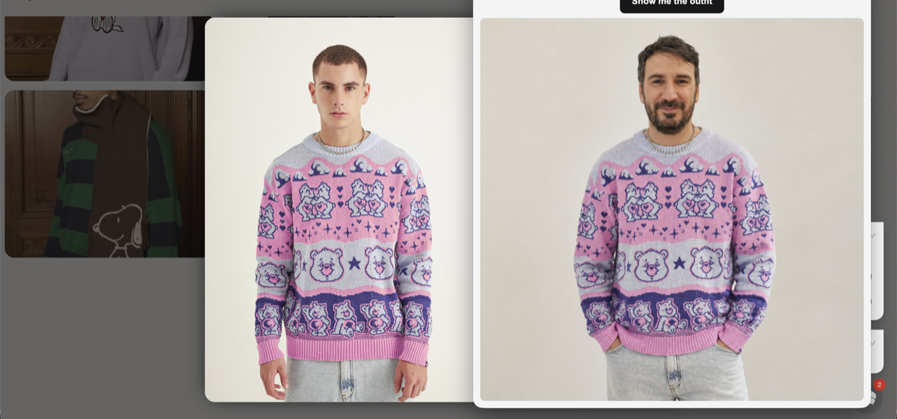

# Fitting Room

**See it on you before you buy it.**

Shopping online and wondering whether that jacket, dress, or full outfit would actually suit you? Fitting Room uses AI to show you — on a photo of you — how the clothes on your screen would look if you were wearing them.

Snap what you’re browsing, and in seconds you get a personalized preview. No changing rooms, no guesswork.



## How it works

1. Open the app and click **Show me the outfit**.
2. Fitting Room grabs what’s on your screen — the product page, lookbook, or outfit you’re eyeing.
3. AI combines that with a photo of you and generates a preview of you wearing it.
4. The result appears right in the app window.

Add a few photos of yourself to `reference-photos/` so the AI has something to work with. When you have more than one, the app rotates through them so previews don’t always use the same shot.

## Requirements

- Node.js ≥ 24.7
- npm ≥ 11.5
- An OpenAI API key

## Platform

Fitting Room is **macOS-first**. The app is built and tested on macOS, and that is the supported experience today.

Screen capture runs through Electron’s desktop APIs and macOS screen recording permission (System Settings → Privacy & Security → Screen Recording). The floating window, capture flow, and permissions model are all oriented around that setup.

It may run on Windows or Linux, but screen capture and permissions are not guaranteed to work the same way — if you are not on macOS, expect rough edges or a broken capture step.

## Setup

```bash
npm install
cp .env.example .env
```

Edit `.env` and set your API key:

```env
OPENAI_API_KEY="sk-..."
```

Add one or more reference photos of yourself to `reference-photos/`. Supported formats: `.jpg`, `.jpeg`, `.png`, `.webp`.

## Run

```bash
npm start
```

## Disclaimer

Fitting Room is intended for personal, lawful use — for example, previewing outfits while you shop online.

You are solely responsible for how you use this software. Do not use it for malicious, deceptive, or harmful purposes, including impersonation, harassment, fraud, non-consensual editing of other people’s likeness, or any activity that violates applicable law or the rights of others.

Image generation and photo manipulation are powered by OpenAI. What you can generate, and what may be blocked, is governed by [OpenAI’s policies](https://openai.com/policies/) and [Usage policies](https://openai.com/policies/usage-policies/), including content and safety rules that apply to input images, prompts, and outputs. Requests may be refused or fail if they fall outside those rules.
